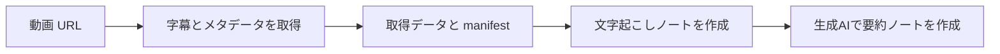
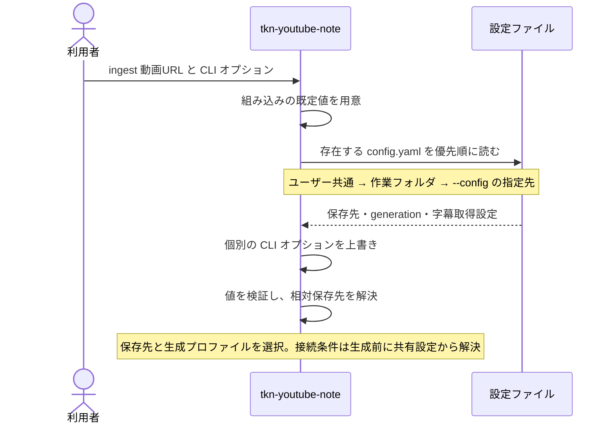
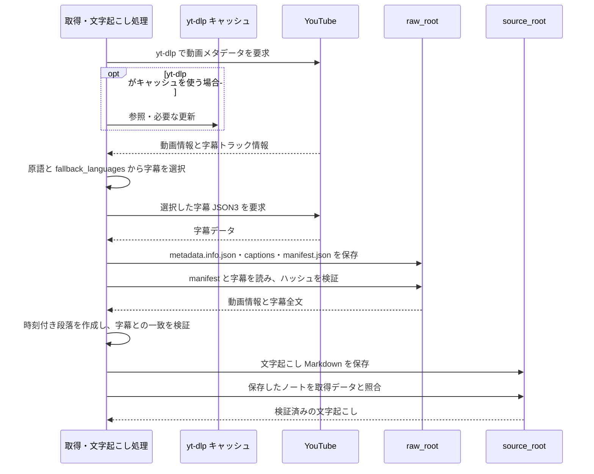
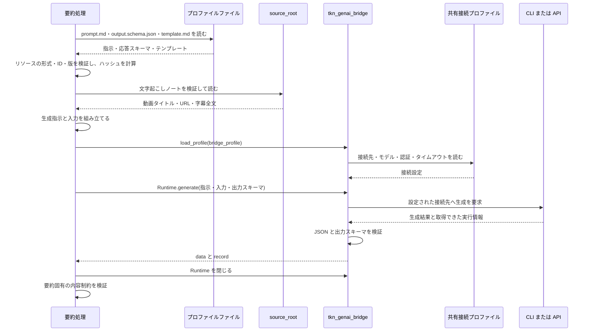
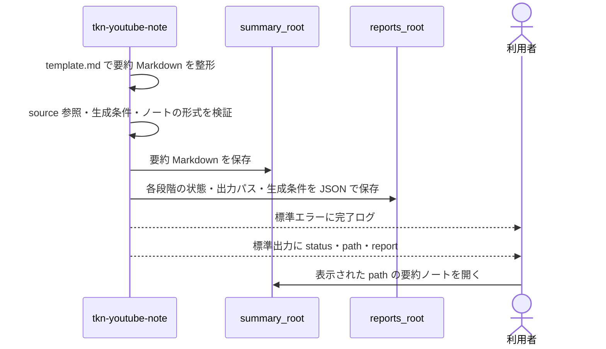

# Tkn YouTube Note Pipeline — YouTube 字幕を要約ノートにする

YouTube 動画の URL を指定すると、字幕を取得し、文字起こしと要約を Markdown ノートとして保存する CLI です。
動画の主張を論点別に読み返し、要点の時刻リンクから元の発言を確認できます。
要約は既定で日本語、設定を変えると英語で作成します。

初めて使う場合は「[セットアップ](#セットアップ)」から「[最初の実行と結果確認](#最初の実行と結果確認)」まで進めてください。
保存済みデータの再利用は「[日常利用と再実行](#日常利用と再実行)」、設定変更は「[設定](#設定)」、古いノートの修復は「[更新とノートの移行](#更新とノートの移行)」を参照してください。

## 得られるノートと処理の流れ

次は、バックアップを説明する架空の動画を要約した場合の本文例です。
実際の生成結果ではなく、構成を示すために一部の節を抜粋しています。
`<video-url>` は元動画の URL を表します。

```markdown
## 1. Summary

動画では、バックアップの保存だけでなく、復元できることを定期的に確認する必要性を説明しています。

## 3. Key points

- [2:10](<video-url>&t=130s) 保存に成功していても、復元手順を確認していなければ、障害時に使えるとは限りません。

## 5. Conclusion

バックアップの目的は、失ったデータを必要なときに戻せるようにすることです。
保存と復元の確認を組み合わせることで、その目的を確かめられます。
```

要約ノートには、動画への参照、概要、論点別の整理、時刻付きの要点、用語、結論を含めます。
別に保存する文字起こしノートでは、取得した字幕全文を時刻付きの段落で読めます。

通常は `ingest` を1回実行すると、次の順に処理します。
矢印はデータの流れを表し、生成AIを使うのは最後の要約作成です。
設定ファイル・プロファイル・保存先・生成AIとのやり取りは、後半の「[設定から保存までのシーケンス](#設定から保存までのシーケンス)」で確認できます。



| 保存するもの               | 役割                                                                                                      |
| -------------------------- | --------------------------------------------------------------------------------------------------------- |
| 取得データ（raw）          | 動画情報、字幕 JSON3、取得条件とハッシュを記録する`manifest.json`。ノートを作り直すための元データです。 |
| 文字起こしノート（source） | 字幕全文を読みやすく整形した Markdown。要約処理の入力にも使います。                                       |
| 要約ノート（summary）      | 生成AIで内容を整理した Markdown。元動画と文字起こしノートを参照できます。                                 |
| 実行レポート               | 処理結果、作成したファイルの場所、失敗理由を記録する JSON。要約本文とは別のファイルです。                 |

入力は1回につき1本の動画です。
`youtube.com/watch?v=...` と `youtu.be/...` に対応し、動画本体はダウンロードしません。
字幕を取得できない場合は要約まで進めません。
対象 URL と字幕の条件は「[対応範囲と制限](#対応範囲と制限)」を参照してください。

## セットアップ

### 必要なもの

- 字幕を取得できる YouTube 動画の URL と、取得データ・ノートを書き込める保存先。
- Python 3.11 以上と [uv](https://docs.astral.sh/uv/)。
- 要約に使う CLI または API の利用準備。既定は認証済みの Codex CLI。

以下の操作例は Windows PowerShell 向けです。
他の OS での実動作は未検証です。

### インストールする

```powershell
cd "C:\path\to\tkn_youtube_note_pipeline"
uv tool install .
tkn-youtube-note --help
```

上記例のパスは、このリポジトリを置いたフォルダパスに置き換えてください。

`tkn-youtube-note --help` でコマンド一覧が表示されれば、インストール完了です。
リポジトリを更新した後の反映方法は「[CLI を更新する](#cli-を更新する)」にあります。

### 設定ファイルを作成する

```powershell
tkn-youtube-note config init
```

`~/.tkn/youtube_note_pipeline/config.yaml` を作成し、`status` と絶対パスを JSON で表示します。
`~` は実行ユーザーのホームフォルダです。
同じ内容のファイルがあれば `unchanged` となり、編集済みのファイルがあれば上書きせずエラーで停止します。
すでに設定済みの場合は、そのファイルを使って次へ進めます。

### 共有設定と、この CLI の生成設定を編集する

本 CLI は、生成AIへの接続を担当する共通ライブラリ [tkn_genai_bridge](https://github.com/tuckn/tkn_genai_bridge)（以下、Bridge）を使います。
接続先・モデル・認証の設定は、Bridge の共有設定ファイル `~/.tkn/genai_bridge/config.yaml` で管理します。
共有設定がある場合は、使うプロファイルを選ぶか追加してください。共有設定がない場合も、組み込みの `codex-default` を使えます。
次は共有設定の例です。`model: null` は Codex CLI の既定モデルを使い、固定したい場合は利用可能なモデル名へ変更します。

```yaml
schema_version: "1.1.0"
default_profile: codex-default
profiles:
  codex-default:
    provider: codex
    model: null
    timeout_seconds: 600
```

次に、本 CLI の `config init` が表示した `config.yaml` で、共有プロファイルの参照を指定します。
保存先を既定値のまま使う場合の最小構成です。作成済みの設定を編集する場合は、保存先など他の項目を保持してください。

```yaml
schema_version: "1.0.0"
generation:
  summary_profile: default-ja
  active_profile: codex
  profiles:
    codex:
      bridge_profile: codex-default
```

`generation.profiles` のキー（この例では `codex`）は、この CLI 内で使う名前です。
その `bridge_profile` が共有設定の `profiles.codex-default` を参照します。
`generation.summary_profile` は要約の言語・構成を選び、接続先とは独立しています。
詳細は「[生成プロファイルと共有設定](#生成プロファイルと共有設定)」、記入例は [config.example.yaml](src/youtube_note_pipeline/resources/config.example.yaml) を参照してください。
Bridge はこの CLI の作業フォルダにある `./.tkn/config.yaml` を読み込まないため、両者の設定ファイルは混同されません。

### 保存先を確認する

初期設定では、取得データとノートを `~/.tkn/youtube_note_pipeline/data/` 以下へ保存します。
そのまま使う場合は設定の編集は不要です。
Obsidian Vault など別の場所へ要約を保存したい場合は、作成した設定ファイルの `summary_root` を変更します。

次は設定の一部です。
例のパスを実際の保存先に置き換え、同名の項目を変更してください。
ほかの項目は残します。

```yaml
source_root: 'C:\path\to\youtube-sources'
summary_root: 'C:\path\to\vault\YouTube'
```

編集後に有効な設定を確認します。

```powershell
tkn-youtube-note config show
```

JSON の `values` にある `raw_root`、`source_root`、`summary_root`、`reports_root` が意図した保存先か確認してください。
`sources` には本 CLI が読み込んだ設定元、`generationResolved` には共有設定から解決した接続先・モデル・待機上限などが表示されます。
`config show` は読み取り専用で、AI の呼び出し・認証・レポート保存を行いません。
作業フォルダの `./.tkn/config.yaml` も読み込むため、想定と異なる値なら「[設定の優先順位](#設定の優先順位)」を確認してください。
保存用フォルダは、通常実行で必要になった時点で作成します。

## 最初の実行と結果確認

### 通信せずに事前確認する

`<video-url>` を、対象動画の URL に置き換えてください。

```powershell
tkn-youtube-note ingest "<video-url>" --dry-run
```

通常実行は取得データ・ノート・実行レポートを書き込みます。
`--dry-run` は設定と入力を検証して計画を表示し、YouTube への通信、生成AIの呼び出し、ファイル作成を行いません。

`status: "planned"` は計画を作成できたことを示します。
取得前には字幕の有無や最終的なノートを確認できないため、後続処理は `details.downstream` に `deferred` と表示します。
Bridge の設定と要求形式を確認しますが、外部 CLI の起動・認証・通信は行わないので、実際の生成が成功することまでは確認できません。

### 要約を作成する

**通常実行では YouTube から字幕と動画情報を取得し、要約が必要な場合は動画タイトル・URL・字幕全文を Bridge で選択した接続先に渡します。**
生成時には利用するサービスの料金や利用枠を消費する場合があります。

```powershell
tkn-youtube-note ingest "<video-url>"
```

取得、文字起こし、要約は順番に実行されます。
`acquire` や `build-source` を先に実行する必要はありません。

### 作成されたノートを確認する

成功時は、進捗に `[SUCCESS]` が表示され、最後に次の形式の JSON が表示されます。
これは架空の保存先を使った説明例です。

```json
{
  "status": "created",
  "path": "C:\\path\\to\\vault\\YouTube\\2026\\20260901_バックアップの基本_70a1a332.md",
  "report": "C:\\path\\to\\reports\\20260925T120000+0900_abcd1234.json"
}
```

`path` が要約ノート、`report` が実行レポートです。
`path` の Markdown を開き、概要・要点・結論を確認してください。
必要に応じて時刻リンクや文字起こしと照合します。
形式の自動検証は処理中に行いますが、要約内容の正確さまで保証するものではありません。

保存済みのファイルをもう一度検証する場合は、`<summary-note>` を表示された `path` に置き換えます。

```powershell
tkn-youtube-note validate "<summary-note>"
```

`valid: true` と空の `errors` が形式上の検証成功を示します。
取得データや文字起こしの場所は、実行レポートの `stages`、または `tkn-youtube-note list` で確認できます。

## 日常利用と再実行

### 別の動画や英語の要約を作成する

動画を追加するときも `ingest "<video-url>"` を使います。
1回だけ英語で要約する場合は、次のように指定します。

```powershell
tkn-youtube-note ingest "<video-url>" --summary-profile default-en
```

`generation.summary_profile` は要約の言語・構成を選ぶ設定です。
取得する字幕の言語は変わりません。
日本語用と英語用ではプロンプトの ID が異なるため、同じ動画でも別の要約ノートを作成できます。

### 同じ動画を再実行する

通常の `ingest` は再実行時にも取得の通信を行います。
取得内容のハッシュが同じなら保存済みの raw を再利用し、検証を通った同じ内容の文字起こしを変更しません。
要約の再利用・更新は「[要約が再生成される条件](#要約が再生成される条件)」に従います。

| 操作                         | 取得データ                                           | 文字起こし・要約                             |
| ---------------------------- | ---------------------------------------------------- | -------------------------------------------- |
| 通常の`ingest`             | 同じ内容なら再利用し、異なれば新しい取得データを保存 | 既存ノートを検証し、再利用・更新・停止を判定 |
| `ingest --refresh`         | 同じ内容でも新しい取得データを保存                   | 通常と同じ判定                               |
| `ingest --force`           | 通常と同じ判定                                       | 両方のノートを再生成して置き換え             |
| `ingest --refresh --force` | 新しい取得データを保存                               | 両方のノートを再生成して置き換え             |

`--overwrite` は `--force` と同じ意味です。
**強制再生成は確認済みの編集内容も置き換えます。**
要約だけを作り直す場合は `build-summary` を使い、保存済みの文字起こしを入力にします。

```powershell
tkn-youtube-note build-summary "<source-note>" --force --dry-run
tkn-youtube-note build-summary "<source-note>" --force
```

上の通常実行は生成AIを呼び出します。
再生成後の要約は `reviewStatus: unreviewed` に戻ります。

### 取得済みの動画とノートを一覧表示する

```powershell
tkn-youtube-note list
```

取得に成功した動画を、最新の取得日時が新しい順に1動画1件で返します。
各項目には最新の manifest と字幕のパス、成功した取得回数、対応するすべての文字起こし・要約ノートが含まれます。
後続ノートがなければ、その一覧は空になります。
読み取れない manifest やノートは `warnings` に表示し、読み取れる項目は引き続き返します。
`count: 0` は、成功した取得データが見つからなかったことを示します。

### 失敗後に保存済みデータから再開する

`ingest` は途中で失敗すると後続処理へ進まず、完了済みのファイルを残します。
エラーに表示された `report` の `error` と `stages` を確認してください。
YouTube から再取得する必要がなければ、次の単独コマンドで未完了の処理を実行できます。

| 保存済みのもの                        | 次に実行するコマンド                               |
| ------------------------------------- | -------------------------------------------------- |
| 成功した取得データの`manifest.json` | `tkn-youtube-note build-source "<manifest>"`     |
| 検証済みの文字起こしノート            | `tkn-youtube-note build-summary "<source-note>"` |

`build-source` の結果に表示された `path` を、次の `build-summary` へ渡します。
単独コマンドは後続処理を自動では実行しません。
OS による強制終了などでレポートが残っていない場合は、`list` と `validate` で保存済みファイルを確認します。

| 代表的な失敗                                 | 確認と対応                                                                                                                                                                                                       |
| -------------------------------------------- | ---------------------------------------------------------------------------------------------------------------------------------------------------------------------------------------------------------------- |
| 許可した字幕を取得できない                   | 原語の字幕があるか確認します。別言語を許可する場合は`fallback_languages` を設定して再取得します。                                                                                                              |
| `source collision` / `summary collision` | 既存ノートと入力・形式が一致していません。`validate` と dry-run で確認し、置き換えてよい場合だけ `--force` を使います。                                                                                      |
| 同じ識別情報を持つノートが複数ある           | 表示された候補を確認し、保存先内の重複を整理します。CLI は自動で1件を選びません。                                                                                                                                |
| 生成AIの起動・生成に失敗する                 | `generation.active_profile`、選択した `bridge_profile` と共有設定の実行ファイル・認証・モデルを確認します。レポートの `provider_error.code` と `provider_error.generation_record` に失敗情報が入ります。 |
| 生成がタイムアウトする                       | 共有設定またはアプリ側プロファイルの`overrides.timeout_seconds` を確認します。`submission_unknown` が true の場合は接続先での完了・課金が不明なため、再実行を判断してください。                              |

## コマンド一覧

各引数の `<...>` は、対象の URL または実際のファイルパスに置き換えてください。
オプションは `ingest` や `config show` などのコマンドの後に指定します。

| 目的                         | コマンド                                               | 結果・詳細                                                                                       |
| ---------------------------- | ------------------------------------------------------ | ------------------------------------------------------------------------------------------------ |
| 動画から要約まで作成         | `ingest "<video-url>"`                               | 取得・文字起こし・要約を保存。[初回実行](#最初の実行と結果確認)                                   |
| 字幕と動画情報だけを取得     | `acquire "<video-url>"`                              | YouTube に通信し、raw とレポートを保存。ノートは作成しません。                                   |
| 別途取得したデータを取り込む | `import-raw --metadata "<file>" --captions "<file>"` | ローカル入力から raw とレポートを保存。[入力形式](#取得データと文字起こし)                        |
| 文字起こしを作成             | `build-source "<manifest>"`                          | 成功した取得データから Markdown とレポートを保存。[再開手順](#失敗後に保存済みデータから再開する) |
| 要約を作成                   | `build-summary "<source-note>"`                      | 生成が必要な場合に Bridge を呼び、Markdown とレポートを保存                                      |
| 取得済みの動画を確認         | `list`                                               | ファイルを読み取り、JSON で[一覧表示](#取得済みの動画とノートを一覧表示する)                      |
| 生成物の形式を検証           | `validate "<artifact>"`                              | manifest またはノートを検証。[結果の読み方](#妥当性と現在の生成条件を確認する)                    |
| 要約の生成条件も確認         | `status "<note>"`                                    | 形式の検証と、選択した要約プロファイルとの差を表示                                               |
| 古いノートの参照を修復       | `migrate-notes`                                      | 通常実行はバックアップ付きで書き込み。[移行手順](#古いノートの参照と形式宣言を修復する)           |
| 設定を作成                   | `config init`                                        | 既存の編集を保護して設定ファイルを作成                                                           |
| 有効な設定を確認             | `config show`                                        | 設定元、最終値、要約リソース、`generationResolved` の実効接続条件を表示                        |

表のコマンドの先頭には `tkn-youtube-note` を付けます。
すべての引数は `tkn-youtube-note <command> --help` で確認できます。
`config` の場合は `tkn-youtube-note config init --help` のように操作まで指定します。

### dry-run の範囲

`ingest`、`acquire`、`import-raw`、`build-source`、`build-summary`、`config init`、`migrate-notes` が `--dry-run` に対応します。
設定とローカル入力を読み取り、アプリケーションのファイル・キャッシュ・レポート・バックアップを作成せず、外部データの取得や生成AIの呼び出しも行いません。

ローカルの build では、通常実行と同じ上書き・再生成の判定を使います。
`build-summary --dry-run` で生成予定の場合は、Bridge の `plan()` により入力・スキーマ・接続設定を検証し、`details.bridge_plan` に入力ハッシュや token 概算を表示します。
`ingest --dry-run` は字幕取得前なので接続設定と要約スキーマを確認し、token・コスト概算は表示しません。`build-summary` が既存要約を再利用する場合は Bridge 設定の読み込みも省略します。
`details.action: "require_force"` は保護のために停止する計画で、終了コードは `1` です。
`migrate-notes` の計画は、変更できる項目を `planned`、解決できない項目を `blocked`、対象外を `skipped` と表示します。
dry-run の計画を `>` などで保存する場合、そのファイルはシェルが作成します。

### 結果・ログ・終了コード

進捗は標準エラー、最終結果の整形済み JSON は標準出力へ表示します。
JSON だけを別の処理へ渡せますが、エラー時には標準エラーだけを出して終了する場合もあります。

- `[INFO]` は処理の開始・進行状況です。
- `[SUCCESS]` は対象の保存・検証が完了した時点で表示します。途中段階の成功だけでは、要約まで完了したことにはなりません。
- `[ERROR]` は処理を完了できなかったことを示します。
- `-q` / `--quiet` は進捗を省略してエラーだけを表示し、`-v` / `--verbose` は詳細な診断情報も表示します。同時には指定できません。

対話的な端末ではレベルに応じて色を付け、リダイレクトやパイプでは無色にします。
生成の失敗は短い要点を表示し、レポートの `provider_error` に Bridge のエラーコードと取得済みのモデル・利用量・HTTP 状態などを保存します。
Bridge 経由の実行では、プロンプト・字幕・応答本文を含む生の診断ログを保存しません。過去の `*.provider.log` は字幕を含む場合があります。

| 処理段階の`status` | 意味                 |
| -------------------- | -------------------- |
| `created`          | 新しいファイルを作成 |
| `updated`          | 既存ファイルを更新   |
| `unchanged`        | 既存ファイルを再利用 |
| `failed`           | 処理に失敗           |
| `planned`          | 実行せず計画を表示   |

manifest と実行レポート全体の `status` は `success` / `failure` です。
終了コードは、正常終了が `0`、処理・検証の失敗や `require_force` が `1`、コマンドの引数エラーが `2` です。
移行では `blocked` が残る場合も `1` になります。
PowerShell では実行直後の `$LASTEXITCODE` で確認できます。

## 設定

### 設定の優先順位

後の値が前の値を上書きします。

1. 組み込みの既定値。
2. ユーザー共通の `~/.tkn/youtube_note_pipeline/config.yaml`。
3. 作業フォルダの `./.tkn/config.yaml`。
4. `--config` で指定した設定ファイル。
5. 個別の CLI オプション。

設定ファイルは必要な項目だけを上書きできます。`generation.profiles` と `overrides` は項目単位で再帰的に統合し、上位の設定で省略したプロファイルや設定値は保持します。リストは全体を置き換えます。
通常の相対保存先は、設定ファイルの場所ではなくコマンド実行時の作業フォルダを基準に解決します。
現在の実装では、存在しない設定ファイルは `--config` の指定先も含めて読み飛ばします。
`config show --config "<config-file>"` の `sources` で、指定したファイルが読み込まれたことを確認してください。

### 保存先と字幕取得

設定は、保存先、字幕取得、要約生成に分けて管理します。
次は [config.example.yaml](src/youtube_note_pipeline/resources/config.example.yaml) の有効な設定項目です。
`schema_version` は本 CLI の設定形式の版です。Bridge の設定形式やノートの `schemaVersion` とは別です。

```yaml
schema_version: "1.0.0"
raw_root: ~/.tkn/youtube_note_pipeline/data/raw
source_root: ~/.tkn/youtube_note_pipeline/data/source
summary_root: ~/.tkn/youtube_note_pipeline/data/summary
reports_root: ~/.tkn/youtube_note_pipeline/state/reports
fallback_languages: []

generation:
  summary_profile: default-ja
  active_profile: codex
  profiles:
    codex:
      bridge_profile: codex-default
```

| 項目                   | 変更すると何が変わるか                                                                   |
| ---------------------- | ---------------------------------------------------------------------------------------- |
| `raw_root`           | 取得データの保存・再利用先と、`list` の検索範囲                                        |
| `source_root`        | 文字起こしの保存・既存ノート検索・移行対象の範囲                                         |
| `summary_root`       | 要約の保存・既存ノート検索・移行対象の範囲                                               |
| `reports_root`       | 実行レポート、旧診断ログ、移行バックアップの保存先                                       |
| `fallback_languages` | 原語の字幕が使えない場合に試す言語の順序。`[]` は代替言語なし。`[en]` なら英語を許可 |

保存先を変えても、既存ファイルは自動移動しません。
別の保存先に同じノートがあっても検索対象外になるため、再生成や重複の原因になります。
各保存先は `--raw-root`、`--source-root`、`--summary-root`、`--reports-root` でも上書きできます。

### 要約の言語と構成

`generation.summary_profile` は `default-ja`（日本語・既定）か `default-en`（英語）を選びます。
1回だけ切り替える場合は `tkn-youtube-note ingest "<video-url>" --summary-profile default-en` と指定します。
プロンプト・出力スキーマ・Markdown テンプレートは、本 CLI に同梱された組を使います。

### 生成プロファイルと共有設定

本 CLI の `generation.profiles` に、利用目的ごとの名前と `bridge_profile` を設定します。
`generation.active_profile` が既定の選択で、`--profile <name>` でその実行だけ切り替えられます。
`bridge_profile` は Bridge の共有設定内の名前です。Bridge 側の `default_profile` を変えても、この参照名は変わりません。

例えば、共有設定で `local-notes` を定義した後、次のように使います。

```yaml
generation:
  active_profile: local
  profiles:
    codex:
      bridge_profile: codex-default
    local:
      bridge_profile: local-notes
```

対応する Bridge の共有設定例です。既存の `profiles` に追加し、モデル名はローカルに導入したものへ置き換えます。

```yaml
profiles:
  local-notes:
    provider: ollama
    model: <installed-local-model>
    local_only: true
    ollama:
      base_url: http://127.0.0.1:11434
```

```powershell
tkn-youtube-note config show --profile local
tkn-youtube-note build-summary "<source-note>" --profile local --dry-run
```

CLI 方式は Codex・Claude Code・GitHub Copilot・Google Antigravity、API 方式は Ollama・Azure OpenAI を選べます。
接続先ごとのモデル・認証・実行ファイル・`local_only` の設定は [Bridge の設定仕様](https://github.com/tuckn/tkn_genai_bridge/blob/fe3ca54d3f974117179655a98b2e5fb12b95f5b7/docs/reference/configuration.md) に従います。
動画タイトル・URL・字幕全文が、選択した接続先へ送られます。

| 選択するもの                | 設定                                          | 1回だけ変更するオプション                   |
| --------------------------- | --------------------------------------------- | ------------------------------------------- |
| 要約の言語・構成            | `generation.summary_profile`                | `--summary-profile`                       |
| この CLI の生成プロファイル | `generation.active_profile`                 | `--profile`                               |
| 共有設定の参照先            | `generation.profiles.<name>.bridge_profile` | `--bridge-profile`                        |
| 共有設定への上書き          | `generation.profiles.<name>.overrides`      | `--model`、`--provider-timeout-seconds` |

通常は接続条件を共有設定で管理します。本 CLI だけで異なる条件が必要な場合は、アプリ側の `overrides` に指定できます。
次の例は、共有設定を変更せず待機上限だけを変えます。

```yaml
generation:
  profiles:
    codex:
      bridge_profile: codex-default
      overrides:
        timeout_seconds: 1800
```

上書きの優先順位は、共有プロファイル → アプリ側プロファイルの `overrides` → 個別 CLI オプションです。
`overrides` の項目と値は Bridge の `Profile` の規則で検証します。待機上限は 0 より大きく 86400 以下の有限値です。
共有設定を継承する項目は `overrides` に書きません。`overrides.model: null` はモデル指定を解除し、CLI 接続先の既定モデルを使う明示的な上書きです。

`config show` の `values.generation` で選択と上書き、`generationResolved` で実効プロバイダー・モデル・推論設定・待機上限を確認します。
不明なプロファイルや不正な上書きはエラーになります。`config show` は失敗してもファイルを作成しません。
既存要約を再利用できる `build-summary` では、Bridge の設定読み込みを省略します。
モデル・接続プロファイル・Bridge の版の変更だけでは既存要約を自動再生成しません。変更後の条件で作り直す場合は、入力と保存先を確認して `build-summary --force` を使います。

### 以前の平坦な設定から移行する

旧形式は互換読み込みできます。新しく設定する場合は、生成設定を `generation` にまとめてください。
同じファイルで旧形式の生成項目と `generation` を混在させるとエラーになります。保存先と `fallback_languages` はそのまま残します。

| 旧形式の項目                 | 新しい設定先                                                                         |
| ---------------------------- | ------------------------------------------------------------------------------------ |
| `summary_profile`          | `generation.summary_profile`                                                       |
| `bridge_profile`           | `generation.profiles.<name>.bridge_profile`                                        |
| `model`                    | 共有プロファイルの`model`。本 CLI 専用なら `overrides.model`                     |
| `provider_timeout_seconds` | 共有プロファイルの`timeout_seconds`。本 CLI 専用なら `overrides.timeout_seconds` |
| `codex_executable`         | 共有プロファイルの`cli.executable`                                                 |
| `provider: codex`          | 共有プロファイルの`provider: codex`                                                |

旧形式の `model: null` と `provider_timeout_seconds: null` は共有設定を継承します。指定した数値・モデルは互換読み込み時も維持します。
旧形式の `provider`・`codex_executable` を残した設定は Codex 接続専用です。別の接続先を使う場合は、上表に従って共有設定と `generation` へ移してください。
`config init` は編集済みの設定を置き換えません。移行後は `config show` と `build-summary "<source-note>" --dry-run` で確認します。
個人環境のパスや認証情報を、公開リポジトリの設定例へ書き込まないでください。

## 保存構造と再生成の条件

### 保存領域の役割

以下のパスは既定値です。
変更した場合は、対応する `*_root` が基準になります。

| 保存領域                                        | 内容と保持する理由                                                                               |
| ----------------------------------------------- | ------------------------------------------------------------------------------------------------ |
| `~/.tkn/youtube_note_pipeline/data/raw/`      | 取得した字幕・動画情報。失うと同じ取得時点のデータで文字起こしを再作成できません。               |
| `~/.tkn/youtube_note_pipeline/data/source/`   | 文字起こしノート。raw から作り直せますが、既存の ID や手作業の編集は元ファイルの保持が必要です。 |
| `~/.tkn/youtube_note_pipeline/data/summary/`  | 要約ノート。再作成には文字起こしと生成AIが必要で、同じ文章になるとは限りません。                 |
| `~/.tkn/youtube_note_pipeline/state/reports/` | 実行履歴と診断ログ。削除すると過去の診断を失いますが、通常のノート生成の入力には使いません。     |
| `reports_root/migrations/`                    | 移行計画、原本バックアップ、結果。移行結果を受け入れるまでは保持してください。                   |
| `~/.cache/youtube_note_pipeline/yt-dlp/`      | 取得用ライブラリのキャッシュ。取得済みの raw やノートとは別に管理します。                        |

通常の取得・取り込み・build・ingest の完了時には、各段階の状態とパスを実行レポートへ保存します。
`ingest` の途中失敗もレポートへ記録しますが、単独コマンドの入力検証エラーなどではレポートを作らず終了する場合があります。
レポートの保存先を削除しても、次に必要となった実行時に作成します。

### 設定から保存までのシーケンス

以下の4つの図は、**新しい動画1本を通常の `ingest` で処理し、正常に完了する場合**を順番に示します。
図の区切りで別のコマンドを実行する必要はありません。
`*_root` は有効な設定で決まった保存先、プロファイルはインストールしたパッケージに含まれるファイルです。
矢印は呼び出しや読み書き、破線の矢印は応答を表します。

#### 1. config.yaml を読み、使用する設定を決める

`config init` による設定ファイルの作成は事前準備です。
`ingest` は既存の設定を読み取り、この段階ではファイルを書き込みません。



ユーザー共通設定は `~/.tkn/youtube_note_pipeline/config.yaml`、作業フォルダの設定は `./.tkn/config.yaml` です。
`generation.summary_profile` が生成指示と出力形式の組を選び、`generation.active_profile` が `generation.profiles` から使う設定を選びます。選択した `bridge_profile` を生成前に共有設定から解決します。

#### 2. YouTube から取得し、文字起こしを保存する

この段階は生成AIを使いません。
取得データを `raw_root` へ保存した後、そこから字幕全文を読み、文字起こしノートを `source_root` へ保存します。



取得キャッシュは `~/.cache/youtube_note_pipeline/yt-dlp/` に置きます。
`raw_root` の取得記録はキャッシュとは別の保存物で、ノートの再作成に使用します。

#### 3. プロファイルを読み、Bridge 経由で生成AIを呼び出す

プロファイルの3ファイルは、パッケージ内の `summary_profiles/<summary_profile>/` から読みます。
`prompt.md` が指示、`output.schema.json` が応答形式、`template.md` が最後に保存する Markdown の形式です。



接続先への呼び出し、認証、タイムアウト、CLI 用の一時ファイル、JSON の検証は Bridge が担当します。
アプリケーションは要約用のプロンプト・スキーマ・テンプレート、内容検証、保存と再利用を担当します。
モデルは共有プロファイルの値を使い、アプリ側の `overrides` や `--model` があればその値を優先します。CLI 接続で解決後の `model` が `null` の場合は、接続先の既定モデルを使います。
1回の生成要求を送り、自動再試行や別接続先への切り替えは行いません。

#### 4. 要約ノートと実行レポートを保存する

生成結果の JSON をテンプレートで Markdown に整形し、検証してから保存します。
要約が参照するのは、元動画と `source_root` に保存した文字起こしです。



再実行では、取得済みの raw や既存ノートを検索し、[再利用・再生成の条件](#要約が再生成される条件)に従います。
要約を再利用できる場合は、Bridge の接続設定読み込みと生成AIの呼び出しを省略します。
途中で失敗した場合は後続処理へ進まず、`ingest` の失敗レポートを `reports_root` に保存します。
Bridge の失敗情報と取得済みの利用量は `provider_error` に保存します。

`--dry-run` はこれらの通信・生成・保存を実行せず、[事前確認の範囲](#dry-run-の範囲)までを計画として表示します。
ノート移行時のバックアップは `reports_root/migrations/` に保存し、通常の `ingest` では作成しません。

### 取得データと文字起こし

各取得データは次の構造で保存し、保存済みの取得データを上書きしません。
`captured-at` は UTC の取得日時で、同じ名前が存在する場合は連番を付けます。

```text
<raw-root>/<video-id>/<captured-at>/
├── metadata.info.json
├── captions.<language>.json3
└── manifest.json
```

manifest は形式の版、ファイルのハッシュ、字幕の選択条件、ツールの版、正規化した動画 URL、成功・失敗を記録します。
取得に失敗した場合は、字幕ファイルがない取得記録を残すことがあります。
失敗した取得データから後続ノートは作成しません。

`import-raw` は、動画 ID・タイトル・公開日などを含む yt-dlp 形式のメタデータ JSON と、字幕 JSON3 を入力にします。
`--language` で字幕の言語を明示できます。
省略時は `captions.<language>.json3` のファイル名、またはメタデータから決めます。

```powershell
tkn-youtube-note import-raw --metadata "<metadata-file>" --captions "<captions-file>" --language ja
```

取り込みはローカル入力を検証し、raw とレポートを保存します。
元ファイルは変更しません。
`acquire` と `import-raw` も、同じ内容なら既存取得データを再利用し、`--refresh` で新しく保存できます。

文字起こしは新規作成時に `source_root/<公開年>/<公開日など>_<タイトル>.md` へ保存します。
Frontmatter（ノート先頭の YAML メタデータ）は `type: transcript`、`schemaVersion: "1.0"` です。
字幕 JSON3 の発話を、全文の一致と時刻を確認しながら読みやすい段落へ整形します。

### 既存ノートを識別する方法

文字起こしは `source_root` 配下を再帰的に検索し、Frontmatter の `url` にある動画 ID で識別します。
要約は `summary_root` 配下の `url` と `promptId` の組み合わせで識別します。
ファイル名を変更したり、同じ保存先の中で移動したりしても、見つかった現在のパスを使います。
同じ識別情報のノートが複数あれば、暗黙に選ばず停止します。

新規要約のファイル名には、文字起こしのファイル名にプロンプト ID の先頭8桁を加えます。
ファイル名が衝突する場合は、その桁数を延ばします。
既存ノートを再生成するときは `noteId` と `date` を保持し、`updated` を更新します。
要約には元の文字起こしへの `source` 参照を記録するため、文字起こしを移動した後は「[ノートの移行](#古いノートの参照と形式宣言を修復する)」も確認してください。

### 要約が再生成される条件

要約プロファイルは、生成指示（プロンプト）、AI の応答形式（出力スキーマ）、Markdown のテンプレートをまとめたものです。
既存要約にはそれぞれの ID・版・SHA-256 を記録し、次のように判定します。

| 既存要約の状態                                                                 | 通常実行での動作           |
| ------------------------------------------------------------------------------ | -------------------------- |
| 同じ動画・プロンプト ID のノートがない                                         | 新しく生成                 |
| 記録された生成条件が一致し、ノートの検証も通る                                 | `unchanged` として再利用 |
| 同じプロンプト ID で版だけが異なり、出力スキーマとテンプレートが変わっていない | 同じノートを自動再生成     |
| プロンプトを同じ版のまま変更、または記録された出力スキーマ・テンプレートが変化 | `--force` を要求         |
| 再利用対象のノートが形式の検証に失敗                                           | 上書きせず停止             |

**プロンプトの版変更による自動再生成も、確認済みの編集を置き換え、`reviewStatus: unreviewed` に戻します。**
更新後の実行前に確認したい場合は、保存済みの文字起こしを指定して `build-summary "<source-note>" --dry-run` を使ってください。

現在の新規要約は `type: summary`、`schemaVersion: "5.0"` です。
`description` は結論を短縮して作成し、`nouns` は生成時に追加しません。
後から別の CLI などで `nouns` を付与したノートも検証できます。
実行レポートには、要約プロファイル、生成リソースの情報、入力ハッシュ、取得できたモデル情報などを記録します。
レポート形式 1.2 では、要約段階の `details.generation_record` に Bridge の実行記録を追加しています。
成功・失敗とも、Bridge の版、接続プロファイル名、生成条件・入力・スキーマのハッシュ、要求モデルと応答モデル、利用量、参考コストを取得できた範囲で保持します。
不明な利用量やコストは `null` のまま保持し、部分利用量は `completeness` と `known_subtotal` で区別します。`provider_version` は外部 CLI の版を取得しないため `null` です。
Bridge の記録は再実行時の調査に使えますが、既存要約の再生成判定は従来どおり要約リソースの情報で行います。

## 対応範囲と制限

| 対象              | 対応する範囲                                                                                                                                                |
| ----------------- | ----------------------------------------------------------------------------------------------------------------------------------------------------------- |
| URL               | `youtube.com/watch?v=...`、`m.youtube.com/watch?v=...`、`youtu.be/...`。watch URL の `t`、`list`、`index` などは除き、1本の動画として扱います。 |
| 対象数            | 1回に1動画。プレイリスト・チャンネル全体の取得や常駐監視は行いません。                                                                                      |
| Shorts などの URL | `/shorts/...` や `/live/...` の直接指定は未対応です。                                                                                                   |
| 字幕              | JSON3 形式。原語の手動字幕、原語の自動字幕、設定した代替言語の順に探します。原語を判定できない場合も代替言語の設定が必要です。                              |
| 字幕のない動画    | 音声認識での文字起こしは行いません。取得に失敗したら要約も作成しません。                                                                                    |
| 要約生成          | Bridge の Codex・Claude Code・GitHub Copilot・Google Antigravity・Ollama・Azure OpenAI 接続を使用。日本語・英語の組み込み要約プロファイルに対応             |
| 要約の根拠        | タイトル・URL・字幕を入力にします。映像や音声そのものは解析しません。                                                                                       |

取得した字幕の誤りは、文字起こしや要約にも影響します。
字幕と文字起こしの全文一致を検証し、動画の長さが分かる場合は字幕末尾と動画終端の差が120秒を超えると停止します。
この検査は字幕の事実関係や、映像だけで伝わる内容の完全性を保証しません。

組み込みの生成指示は、発言者の主張と事実・例・比喩を区別し、外部知識や根拠のない推測を追加せず、動画全体を論点別に整理するよう求めます。
主題に不要な広告や行動喚起は要約から除きます。
生成AIへの入力は字幕全文であり、長い動画を分割して処理する機能はありません。
扱える量は選択したモデルやサービスの制約に依存します。

## 更新とノートの移行

### CLI を更新する

更新済みのリポジトリで再インストールし、コマンドを確認します。

```powershell
cd "C:\path\to\tkn_youtube_note_pipeline"
uv tool install . --reinstall
tkn-youtube-note --help
```

通常の更新には `--reinstall` を使います。
実行ファイルの競合やツール環境の破損で再作成が必要な場合に限り、`uv tool install . --force` を使います。

更新によって要約の生成条件が変わる場合があります。
出力スキーマ 1.1 の要約を、出力スキーマ 1.2 と日本語プロンプト 2.3／英語プロンプト 1.3 で再生成する場合は `--force` が必要です。
既存ノートは古い形式のままでも検証できます。
この出力スキーマの版変更では、ノートの `schemaVersion` は 5.0 のままです。

### 妥当性と現在の生成条件を確認する

```powershell
tkn-youtube-note validate "<summary-note>"
tkn-youtube-note status "<summary-note>" --summary-profile default-ja
```

`validate` は、ノートが宣言した形式の版に従って検証します。
対応する要約ノートの版は 1.0、1.1、2.0、3.0、4.0、5.0 です。
`status` はさらに、選択したプロファイルとの一致を `currency.is_current`、異なる項目を `currency.differences` で表示します。

古いノートでも、その版の規則に従っていれば `valid: true` です。
`currency.is_current: false` だけでは検証失敗にならず、終了コードも失敗扱いにはなりません。
未知の版や、登録された履歴と一致しない出力スキーマ・テンプレートは検証エラーになります。

### 古いノートの参照と形式宣言を修復する

`migrate-notes` は、設定した `source_root` と `summary_root` だけを検索します。
要約内の文字起こし参照を修復し、一部の古い形式宣言を、実際の内容に合う版へ変更します。
**通常実行は書き込むため、先に計画を保存して変更対象を確認してください。**

```powershell
tkn-youtube-note migrate-notes --dry-run | Set-Content -Encoding utf8 migration-plan.json
```

計画は UTF-8 の `migration-plan.json` に保存します。
ファイルを開き、各項目の状態と変更内容を確認します。
`planned` は変更対象、`blocked` は候補が曖昧・矛盾するなどの理由で適用できない項目です。
次のコマンドは、確認した計画を適用します。

```powershell
tkn-youtube-note migrate-notes --apply-plan migration-plan.json
```

| 修復対象                                     | 変更内容                                                                                            |
| -------------------------------------------- | --------------------------------------------------------------------------------------------------- |
| 文字起こしへの`source` 参照                | 動画 URL、ノート ID、既存の`sourceNoteId`、ファイルの実在を照合し、一意に確認できた参照へ修復     |
| 修復時の`sourceNoteId`                     | 確認した文字起こしのノート ID を記録                                                                |
| 1.0 を宣言しながら`type: summary` のノート | 1.1 へ変更。欠落したプロンプト情報を補作せず、旧来の文字起こし側 description の更新も要求しない形式 |
| 2.0 を宣言しながら`type: summary` のノート | 3.0 へ変更                                                                                          |
| 形式の宣言がないノート                       | 参照だけを修復し、推測した形式の版は付けない                                                        |

移行後の形式を事前に検証できた変更だけを計画します。
計画にある Frontmatter の項目だけを変更し、本文のバイト列、ユーザー独自の項目、確認状態、`noteId`、`date`、`updated`、BOM、改行コードを保持します。
参照には設定した論理パスを使い、実体のパスも保存先の範囲内にあることを確認します。

適用前に計画を再計算し、文字起こしと要約のハッシュを照合します。
計画後に対象を編集した場合は、計画を作り直して確認してください。
`blocked` の項目は残したまま、適用可能な `planned` の項目だけを変更できます。
この場合も終了コードは `1` なので、部分的な適用結果を確認してください。

原本バックアップと対象ファイルの対応は、`reports_root/migrations/` 配下の `result.json` に記録します。
処理中のエラーでは完了分を記録しますが、OS による強制終了時は結果ファイルが残らない場合があります。
復元するときはバックアップと対象を照合してください。
結果を受け入れるまではバックアップを保持し、修復後に新しい計画を作成して `unchanged` を確認します。

## 開発と検証

### 開発環境を用意する

```powershell
cd "C:\path\to\tkn_youtube_note_pipeline"
uv sync --locked
uv run pytest
uv run mypy
uv run ruff check .
uv build
```

テストは人工データと置き換えた生成処理を使います。
実際の YouTube や各生成AI接続先での確認は別途行う操作であり、通常のテスト成功は認証・通信・生成品質の確認を意味しません。

Bridge は `pyproject.toml` に指定した固定コミットの ZIP URL から uv が取得します。
Bridge を更新する場合は URL 内のコミットを変更し、`uv lock` で `uv.lock` を更新してから、テストと本 CLI の再インストールを行ってください。

ソースの変更をインストール済み CLI にすぐ反映したい場合は、開発用の editable インストールを使います。

```powershell
cd "C:\path\to\tkn_youtube_note_pipeline"
uv tool install -e . --reinstall
```

通常のソース変更は再インストールせずに反映されます。
依存関係・パッケージ定義・実行コマンドの変更、リポジトリの移動や改名後は、同じコマンドで再インストールしてください。
editable のまま強制作成が必要な場合は `uv tool install -e . --force` を使います。

### 要約プロファイルを変更する

生成指示、出力スキーマ、テンプレートは、アプリケーションが同梱する1組のリソースとして管理します。
利用者は組み込みプロファイルを選べますが、個別のリソースや任意のカスタムプロンプトを設定で指定する機能はありません。

```text
src/youtube_note_pipeline/summary_profiles/
├── default-ja/
│   ├── prompt.md
│   ├── output.schema.json
│   └── template.md
└── default-en/
    ├── prompt.md
    ├── output.schema.json
    └── template.md
```

| ファイル               | 担当する内容                                                |
| ---------------------- | ----------------------------------------------------------- |
| `prompt.md`          | 要約の品質、出典に沿うための規則、各項目へ含める内容        |
| `output.schema.json` | 生成AIが返す JSON の項目・型・階層                          |
| `template.md`        | Markdown の Frontmatter、見出し、順序、箇条書き、時刻リンク |

プロファイルを追加するときは、同じ階層に3ファイルを用意し、`summary_resources.py` の `BUILT_IN_SUMMARY_PROFILES` に名前を登録します。
読み込み・描画・検証を一緒に確認してください。
Python 側はリソースの ID・版・SHA-256、JSON Schema、テンプレートの項目を検証し、3つのハッシュからプロファイル全体のハッシュを計算します。
アプリケーションは Bridge に生成要求を渡し、実行記録の保存、ノートの整形・保存・検証を担当します。外部プロセスや API の実行は Bridge に委ねます。

過去のノートの検証規則は [summary_contracts.json](src/youtube_note_pipeline/resources/summary_contracts.json) に保持します。
生成形式を追加するときは、過去の規則を上書きせず新しい契約を追記してください。
生成プロセス用の一時ファイルには OS の一時フォルダを使い、ノートは保存先の隣で準備してから置き換えます。

## 関連資料

- [設定例](src/youtube_note_pipeline/resources/config.example.yaml)：初期設定の全項目。
- [日本語の要約指示](src/youtube_note_pipeline/summary_profiles/default-ja/prompt.md)／[英語の要約指示](src/youtube_note_pipeline/summary_profiles/default-en/prompt.md)：生成する要約の内容と制約。
- [CLI の定義](src/youtube_note_pipeline/cli.py)：コマンドと引数。
- [過去の要約形式の検証規則](src/youtube_note_pipeline/resources/summary_contracts.json)：保存済みノートの互換性。
- [テスト](tests/)：人工データによる動作確認。
- [MIT License](LICENSE)。
