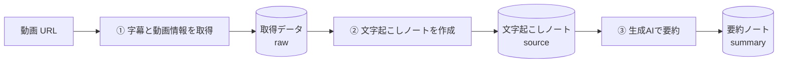
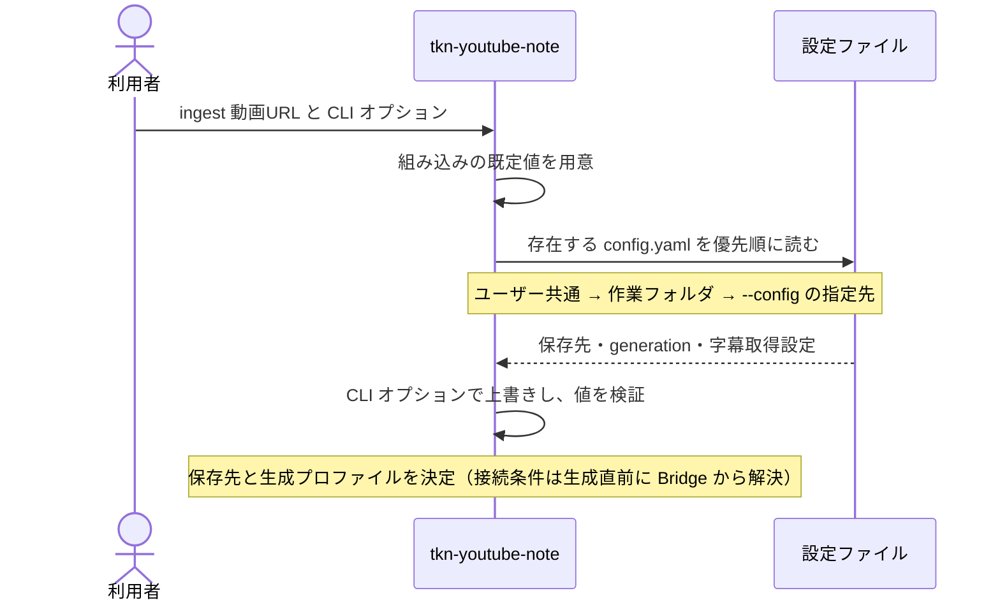
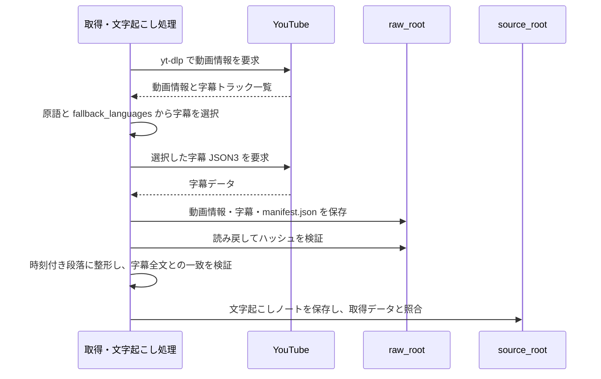
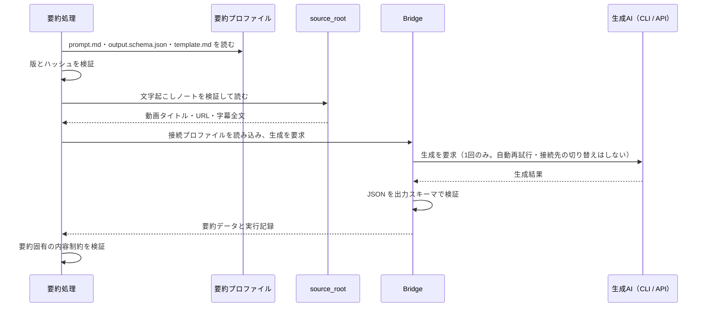
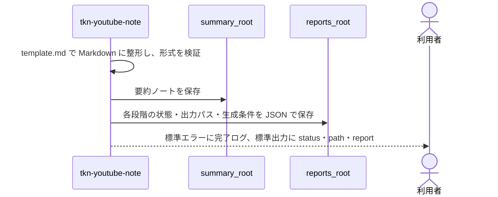

# Tkn YouTube Note Pipeline

YouTube 動画の URL を1つ渡すと、字幕を取得して保存し、生成AIで要約した Markdown ノートを作る CLI です。

- **何が得られるか**：論点別に整理された要約ノートと、字幕全文を読みやすく整えた文字起こしノート。要点には動画の該当時刻へのリンクが付くので、元の発言をすぐ確認できます。
- **何を使うか**：字幕の取得に [yt-dlp](https://github.com/yt-dlp/yt-dlp)、要約に生成AI（既定は Codex CLI。Claude Code・GitHub Copilot・Ollama・Azure OpenAI なども選択可）。
- **言語**：要約は既定で日本語。設定またはオプションで英語にも切り替えられます。

> [!NOTE]
> 動作確認は Windows のみです。本文のパスも Windows 形式で記載しています。

初めて使う場合は「[できること・できないこと](#できることできないこと)」で用途に合うかを確かめ、「[クイックスタート](#クイックスタート)」または「[セットアップ](#セットアップ)」から「[基本的な使い方](#基本的な使い方)」まで進めてください。
コマンド・設定・エラーへの対処は、「[コマンドリファレンス](#コマンドリファレンス)」以降を必要なときに参照してください。

## できること・できないこと

### 要約ノートの形

要約ノートは、Frontmatter（ノート先頭の YAML メタデータ）・タイトル・元動画への参照に続き、次の5節で構成されます。
上から順に「全体像 → 結論 → 根拠 → 構造 → 用語」と、必要な深さまで読み進められる並びです。

1. `Summary`：動画全体の概要
2. `Conclusion`：動画の結論
3. `Key points`：論点ごとの要点（時刻リンク付き）
4. `Structuring (from abstract to concrete)`：抽象から具体への構造化
5. `Technical terms`：用語の解説

次は構成を示すための抜粋例です（実際の生成結果ではありません）。`<video-url>` は元動画の URL です。

```markdown
## 1. Summary

動画では、バックアップの保存だけでなく、復元できることを定期的に確認する必要性を説明しています。

## 2. Conclusion

バックアップの目的は、失ったデータを必要なときに戻せるようにすることです。
保存と復元の確認を組み合わせることで、その目的を確かめられます。

## 3. Key points

- [2:10](<video-url>&t=130s) 保存に成功していても、復元手順を確認していなければ、障害時に使えるとは限りません。
```

### 処理の流れと保存されるもの

`ingest` コマンドを1回実行すると、次の3段階を順に実行します。生成AIを使うのは最後の要約作成だけです。



| 保存されるもの             | 内容                                                                                   | 役割                                                         |
| -------------------------- | -------------------------------------------------------------------------------------- | ------------------------------------------------------------ |
| 取得データ（raw）          | 動画情報 JSON、字幕 JSON3、取得条件とハッシュを記録した `manifest.json`                | ノートを作り直すための原本。上書きせず取得のたびに追加保存   |
| 文字起こしノート（source） | 字幕全文を時刻付きの段落に整えた Markdown                                              | 人が読むための全文。要約の入力にもなる                       |
| 要約ノート（summary）      | 生成AIが整理した Markdown                                                              | 主な成果物。元動画と文字起こしノートへの参照を持つ           |
| 実行レポート               | 各段階の結果・作成ファイルの場所・失敗理由を記録した JSON                              | 失敗時の調査と再開の手がかり                                 |

3段階を分けて保存しているのは、途中で失敗しても完了した段階から再開でき、YouTube に再アクセスせずにノートを作り直せるようにするためです。

### 対応範囲

| 項目       | 対応                                                                                                           | 非対応                                               |
| ---------- | -------------------------------------------------------------------------------------------------------------- | ---------------------------------------------------- |
| URL        | `youtube.com/watch?v=...`、`m.youtube.com/watch?v=...`、`youtu.be/...`（`t`・`list` などのパラメーターは無視） | `/shorts/...`、`/live/...` の直接指定                |
| 対象数     | 1回の実行で1本                                                                                                 | プレイリスト・チャンネル一括取得、常駐監視           |
| 字幕       | YouTube の字幕（手動・自動）                                                                                   | 字幕のない動画（音声認識は行わない）                 |
| 要約の根拠 | 動画タイトル・URL・字幕全文                                                                                    | 映像・音声そのものの解析                             |
| 長さ       | 選択したモデルが一度に扱える量まで                                                                             | 長い動画を分割して要約する処理                       |

動画本体はダウンロードしません。字幕を取得できなかった場合、要約までは進みません。

## クイックスタート

[uv](https://docs.astral.sh/uv/) と、認証済みの [Codex CLI](https://github.com/openai/codex) がある前提の最短手順です。

```shell
# 1. インストール（リポジトリのフォルダで実行）
cd "C:\path\to\tkn_youtube_note_pipeline"
uv tool install .

# 2. 設定ファイルを作成
tkn-youtube-note config init

# 3. 通信せずに実行計画だけ確認
tkn-youtube-note ingest "https://www.youtube.com/watch?v=<video-id>" --dry-run

# 4. 実行して要約ノートを作成
tkn-youtube-note ingest "https://www.youtube.com/watch?v=<video-id>"
```

最後に表示される JSON の `path` が要約ノートの場所です。
既定の保存先は `~/.tkn/youtube_note_pipeline/data/` 以下です（`~` はユーザーのホームフォルダ）。

> [!IMPORTANT]
> 手順4では、動画タイトル・URL・**字幕全文**が生成AIの接続先へ送信されます。利用するサービスの料金や利用枠を消費する場合があります。

## セットアップ

### 必要なもの

- Python 3.11 以上と [uv](https://docs.astral.sh/uv/)
- 要約に使う生成AIの利用環境（既定は認証済みの Codex CLI）
- 字幕付きの YouTube 動画

### インストール

```shell
cd "C:\path\to\tkn_youtube_note_pipeline"
uv tool install .
tkn-youtube-note --version
```

バージョンが表示されればインストール完了です。コマンド一覧は `tkn-youtube-note --help` で確認できます。

### 設定ファイルを作成する

```shell
tkn-youtube-note config init
```

`~/.tkn/youtube_note_pipeline/config.yaml` が作成され、その絶対パスが JSON で表示されます。
すでに同じ内容のファイルがあれば `unchanged`、編集済みのファイルがあれば上書きせずにエラーで停止します（手元の編集は保護されます）。

### 生成AIの接続先を設定する

この CLI は、生成AIへの接続を共通ライブラリ [tkn_genai_bridge](https://github.com/tuckn/tkn_genai_bridge)（以下 **Bridge**）に任せています。
そのため設定は2層に分かれます。

| 設定ファイル                                    | 管理するもの                                         | 例                               |
| ----------------------------------------------- | ---------------------------------------------------- | -------------------------------- |
| Bridge の設定 `~/.tkn/genai_bridge/config.yaml` | 接続先・モデル・認証・タイムアウト（他ツールと共有） | `codex-default`、`claude-default` |
| この CLI の設定 `~/.tkn/youtube_note_pipeline/config.yaml` | どの Bridge プロファイルを使うか                     | `bridge_profile: codex-default`  |

**Codex CLI を既定のまま使うなら、Bridge の設定ファイルは不要です。** ファイルがない場合、Bridge は組み込みの `codex-default`（Codex CLI・CLI 側の既定モデル）を使います。

別の接続先を使う場合は、まず Bridge の設定ファイルに接続プロファイルを定義します（書き方は [Bridge の設定仕様](https://github.com/tuckn/tkn_genai_bridge/blob/fe3ca54d3f974117179655a98b2e5fb12b95f5b7/docs/reference/configuration.md) を参照）。

```yaml
# ~/.tkn/genai_bridge/config.yaml（一部）
profiles:
  codex-default:
    provider: codex
    model: null
  claude-default:
    provider: claude
    # ...
```

次に、この CLI の設定で、その Bridge プロファイルを参照します。

```yaml
# ~/.tkn/youtube_note_pipeline/config.yaml（一部）
generation:
  active_profile: claude          # 既定で使うプロファイル（下の profiles のキー）
  profiles:
    codex:                        # この CLI 内での呼び名（任意の名前）
      bridge_profile: codex-default
    claude:
      bridge_profile: claude-default
```

- `generation.profiles` のキー（`codex`、`claude`）は、この CLI の中だけで使う名前です。
- `active_profile` は既定で使うプロファイルです。1回だけ変えるときは `--profile codex` のように指定します。
- `generation.summary_profile`（要約の言語とプロンプトの選択）は、接続先の設定とは無関係です。[要約の言語と構成](#要約の言語と構成)を参照してください。

### 保存先を変える（任意）

既定では `~/.tkn/youtube_note_pipeline/data/` 以下に保存します。
たとえば要約ノートだけを Obsidian Vault などに置きたい場合は、設定ファイルの該当項目を書き換えます（他の項目はそのまま残します）。

```yaml
summary_root: 'C:\path\to\vault\YouTube'
```

### 設定を確認する

```shell
tkn-youtube-note config show
```

表示される JSON の主な見どころは次のとおりです。この操作は読み取り専用で、生成AIの呼び出しやファイル作成は行いません。

| キー                 | 確認すること                                                                 |
| -------------------- | ---------------------------------------------------------------------------- |
| `values`             | `raw_root`・`source_root`・`summary_root`・`reports_root` が意図した保存先か |
| `sources`            | どの設定ファイルが読み込まれたか                                             |
| `generationResolved` | 最終的に使われる接続先・モデル・待機上限                                     |

作業フォルダの `./.tkn/config.yaml` も読み込まれるため、想定外の値が出たら[設定の優先順位](#設定の優先順位)を確認してください。

## 基本的な使い方

以下、`<video-url>` は対象動画の URL に置き換えてください。

### 1. 事前確認する（dry-run）

```shell
tkn-youtube-note ingest "<video-url>" --dry-run
```

`--dry-run` は設定と入力を検証し、実行計画を表示するだけです。YouTube への通信、生成AIの呼び出し、ファイル作成は行いません。
`status: "planned"` と表示されれば計画は正常です。

ただし、字幕の有無や生成AIの認証は実際に通信するまで分からないため、dry-run の成功は本番の成功を保証しません。

### 2. 要約を作成する

```shell
tkn-youtube-note ingest "<video-url>"
```

取得 → 文字起こし → 要約を続けて実行します。個別のコマンド（`acquire` など）を先に実行する必要はありません。
成功すると `[SUCCESS]` が表示され、最後に次のような JSON が出力されます。

```json
{
  "status": "created",
  "path": "C:\\path\\to\\vault\\YouTube\\2026\\20260901_バックアップの基本_70a1a332.md",
  "report": "C:\\path\\to\\reports\\20260925T120000+0900_abcd1234.json"
}
```

| キー     | 意味                                               |
| -------- | -------------------------------------------------- |
| `status` | `created`（新規作成）、`updated`、`unchanged` など |
| `path`   | 要約ノートの場所                                   |
| `report` | 実行レポートの場所                                 |

### 3. 結果を確認する

`path` の Markdown を開いて内容を確認します。必要に応じて、時刻リンクや文字起こしノートと照らし合わせてください。

> [!NOTE]
> 保存時にはノートの**形式**を自動検証しますが、要約**内容**の正確さは保証しません。

保存済みノートの形式をあらためて検証するには `validate` を使います。`valid: true` かつ `errors` が空なら形式上は正常です。

```shell
tkn-youtube-note validate "<summary-note>"
```

### 英語で要約する

```shell
tkn-youtube-note ingest "<video-url>" --summary-profile default-en
```

変わるのは要約の言語と構成だけで、取得する字幕の言語は変わりません。
日本語版と英語版は別ノートとして保存されるため、同じ動画で両方を持てます。
常に英語にしたい場合は、設定ファイルの `generation.summary_profile` を `default-en` にします。

### 取得済みの動画を一覧表示する

```shell
tkn-youtube-note list
```

取得に成功した動画を、新しく取得した順に1動画1件で表示します。各項目には最新の取得データ、取得回数、対応する文字起こし・要約ノートのパスが含まれます。
読み取れないファイルは `warnings` に表示され、残りの項目は通常どおり表示されます。

### 同じ動画をもう一度実行する

再実行しても、内容が変わっていなければ既存のファイルを再利用します（毎回作り直すわけではありません）。挙動はオプションで変えられます。

| 実行方法                   | 取得データ                                 | 文字起こし・要約ノート                           |
| -------------------------- | ------------------------------------------ | ------------------------------------------------ |
| `ingest`                   | 取得し直し、内容が同じなら既存を再利用     | 既存を検証し、再利用・更新・停止のいずれかを判定 |
| `ingest --refresh`         | 内容が同じでも新しく保存                   | 同上                                             |
| `ingest --force`           | `ingest` と同じ                            | **両方を再生成して置き換え**                     |
| `ingest --refresh --force` | 新しく保存                                 | **両方を再生成して置き換え**                     |

要約の再利用・再生成の判定基準は[要約が再生成される条件](#要約が再生成される条件)を参照してください。

> [!WARNING]
> `--force`（別名 `--overwrite`）は、手作業で編集した内容も置き換えます。

要約だけを作り直したいときは、保存済みの文字起こしノートを入力に `build-summary` を使います（YouTube には再アクセスしません）。

```shell
tkn-youtube-note build-summary "<source-note>" --force --dry-run   # 計画を確認
tkn-youtube-note build-summary "<source-note>" --force             # 生成AIを呼び出して再生成
```

再生成した要約の Frontmatter は `reviewStatus: unreviewed`（未確認）に戻ります。

## コマンドリファレンス

すべてのコマンドは `tkn-youtube-note <command>` の形式で実行します。詳しい引数は `tkn-youtube-note <command> --help`（`config` は `config init --help` のように操作まで指定）で確認できます。

### コマンド一覧

| 分類     | コマンド                                             | 内容                                                                                   |
| -------- | ---------------------------------------------------- | -------------------------------------------------------------------------------------- |
| 一括実行 | `ingest "<video-url>"`                               | 取得・文字起こし・要約をまとめて実行                                                   |
| 個別実行 | `acquire "<video-url>"`                              | 字幕と動画情報だけを取得して保存（ノートは作らない）                                   |
|          | `import-raw --metadata "<file>" --captions "<file>"` | 別途用意した動画情報・字幕ファイルを取得データとして取り込む（[入力形式](#取得データの構造)） |
|          | `build-source "<manifest>"`                          | 取得データから文字起こしノートを作成                                                   |
|          | `build-summary "<source-note>"`                      | 文字起こしノートから要約ノートを作成（生成AIを使用）                                   |
| 確認     | `list`                                               | 取得済みの動画と対応ノートを一覧表示                                                   |
|          | `validate "<file>"`                                  | manifest またはノートの形式を検証                                                      |
|          | `status "<note>"`                                    | 形式の検証に加え、現在の要約プロファイルとの差分を表示                                 |
|          | `migrate-notes`                                      | 古いノートの参照と形式宣言を修復                                                       |
| 設定     | `config init`                                        | 設定ファイルを作成（編集済みなら上書きしない）                                         |
|          | `config show`                                        | 最終的に有効な設定と、その設定元を表示                                                 |

`acquire`・`import-raw` も `--refresh` に対応し、`build-source`・`build-summary` も `--force` に対応します。

### 主な共通オプション

オプションはコマンド名の後に指定します（例：`ingest "<video-url>" --profile local`）。

| オプション                                                            | 内容                                                         |
| --------------------------------------------------------------------- | ------------------------------------------------------------ |
| `--dry-run`                                                           | 書き込み・通信・生成AI呼び出しをせず、計画だけを表示         |
| `--config <file>`                                                     | 追加で読み込む設定ファイル                                   |
| `--raw-root` / `--source-root` / `--summary-root` / `--reports-root`  | 保存先をその実行だけ変更                                     |
| `--summary-profile default-ja\|default-en`                            | 要約の言語・構成をその実行だけ変更                           |
| `--profile <name>`                                                    | 使う生成プロファイルをその実行だけ変更                       |
| `--bridge-profile <name>` / `--model <name>` / `--provider-timeout-seconds <秒>` | 接続設定の一部をその実行だけ上書き                           |
| `-q` / `--quiet`、`-v` / `--verbose`                                  | 進捗表示を省略 / 詳細な診断情報を表示（同時指定不可）        |

### dry-run の範囲

`ingest`・`acquire`・`import-raw`・`build-source`・`build-summary`・`config init`・`migrate-notes` が `--dry-run` に対応します。
いずれも設定とローカルファイルの読み取りだけを行い、ファイル・レポート・バックアップの作成、外部への通信、生成AIの呼び出しはしません。

- `build-summary --dry-run` で生成が必要な場合は、入力・スキーマ・接続設定を検証し、入力ハッシュや token 数の概算を `details.bridge_plan` に表示します。
- `ingest --dry-run` は字幕を取得しないため、接続設定と要約スキーマの確認までです（token 数の概算は出ません）。
- `details.action: "require_force"` は「実行すると既存ノートを保護するため停止する」という計画で、終了コードは `1` です。

### 出力と終了コード

進捗ログは**標準エラー**、最終結果の JSON は**標準出力**に出ます。そのため JSON だけをパイプで他の処理へ渡せます（エラー時は標準エラーだけを出して終了する場合があります）。

| ログ        | 意味                                                             |
| ----------- | ---------------------------------------------------------------- |
| `[INFO]`    | 処理の開始・進行状況                                             |
| `[SUCCESS]` | 対象の保存・検証が完了（途中段階の成功は要約完了を意味しない）   |
| `[ERROR]`   | 処理を完了できなかった                                           |

各段階の `status` は次のいずれかです。manifest と実行レポート全体の `status` は `success` / `failure` です。

| `status`    | 意味                 |
| ----------- | -------------------- |
| `created`   | 新しいファイルを作成 |
| `updated`   | 既存ファイルを更新   |
| `unchanged` | 既存ファイルを再利用 |
| `failed`    | 処理に失敗           |
| `planned`   | dry-run の計画       |

| 終了コード | 意味                                                                   |
| ---------- | ---------------------------------------------------------------------- |
| `0`        | 正常終了                                                               |
| `1`        | 処理・検証の失敗、`require_force`、`migrate-notes` で `blocked` が残った |
| `2`        | コマンドの引数エラー                                                   |

## 設定リファレンス

### 設定の優先順位

下にあるものほど優先されます（前の値を上書きします）。

1. 組み込みの既定値
2. ユーザー共通の `~/.tkn/youtube_note_pipeline/config.yaml`
3. 作業フォルダの `./.tkn/config.yaml`
4. `--config` で指定したファイル
5. 個別の CLI オプション

- 設定ファイルには変更したい項目だけを書けば十分です。`generation.profiles` と `overrides` は項目単位で統合され、リストは全体が置き換わります。
- 相対パスの保存先は、設定ファイルの場所ではなく**コマンドを実行したフォルダ**を基準に解決されます。
- 存在しない設定ファイルは、`--config` で指定したものも含めてエラーにならず読み飛ばされます。指定したファイルが読まれたかは `config show --config "<file>"` の `sources` で確認してください。
- Bridge は作業フォルダの `./.tkn/config.yaml` を読まないため、この CLI の設定と Bridge の設定が混ざることはありません。

### 設定項目

[config.example.yaml](src/youtube_note_pipeline/resources/config.example.yaml) の内容です。

```yaml
schema_version: "1.0.0"
raw_root: ~/.tkn/youtube_note_pipeline/data/raw
source_root: ~/.tkn/youtube_note_pipeline/data/source
summary_root: ~/.tkn/youtube_note_pipeline/data/summary
reports_root: ~/.tkn/youtube_note_pipeline/state/reports
fallback_languages: []

generation:
  summary_profile: default-ja
  active_profile: codex
  profiles:
    codex:
      bridge_profile: codex-default
```

| 項目                 | 内容                                                                                                 |
| -------------------- | ---------------------------------------------------------------------------------------------------- |
| `schema_version`     | この設定ファイルの形式の版（Bridge の設定やノートの `schemaVersion` とは無関係）                     |
| `raw_root`           | 取得データの保存先。`list` の検索範囲でもある                                                        |
| `source_root`        | 文字起こしノートの保存先。既存ノートの検索範囲でもある                                               |
| `summary_root`       | 要約ノートの保存先。既存ノートの検索範囲でもある                                                     |
| `reports_root`       | 実行レポートと、保守コマンドのバックアップの保存先                                                   |
| `fallback_languages` | 動画の原語の字幕が使えないときに試す言語（順序どおり）。`[]` は代替なし、`[en]` なら英語を許可       |
| `generation.*`       | 要約の言語・構成と生成AIの選択（次節以降）                                                           |

> [!WARNING]
> 保存先を変更しても既存ファイルは移動しません。移動しないと古い保存先のノートが検索対象から外れ、重複作成の原因になります。

### 要約の言語と構成

`generation.summary_profile` で、同梱の**要約プロファイル**を選びます。要約プロファイルとは、生成指示（`prompt.md`）・AI の応答形式（`output.schema.json`）・保存する Markdown の形（`template.md`）の3点セットです。

| 値           | 内容             |
| ------------ | ---------------- |
| `default-ja` | 日本語で要約（既定） |
| `default-en` | 英語で要約       |

任意のプロンプトを設定ファイルから指定する機能はありません。プロファイルの追加方法は[要約プロファイルを変更する](#要約プロファイルを変更する)を参照してください。

### 生成プロファイルと接続設定の上書き

混同しやすい「プロファイル」が3種類あります。役割と、1回だけ変えるオプションの対応は次のとおりです。

| 種類                                   | 設定する場所                                | 選ぶもの                   | 1回だけ変えるオプション                          |
| -------------------------------------- | ------------------------------------------- | -------------------------- | ------------------------------------------------ |
| 要約プロファイル                       | `generation.summary_profile`                | 要約の言語・構成           | `--summary-profile`                              |
| 生成プロファイル（この CLI 内の名前）  | `generation.active_profile`                 | 下記の Bridge 参照と上書き | `--profile`                                      |
| Bridge プロファイル                    | `generation.profiles.<name>.bridge_profile` | 接続先・モデル・認証       | `--bridge-profile`                               |
| （接続設定の部分上書き）               | `generation.profiles.<name>.overrides`      | モデル・待機上限など       | `--model`、`--provider-timeout-seconds`          |

接続設定の値は「Bridge プロファイル → この CLI の `overrides` → CLI オプション」の順に上書きされます。
Bridge 側の設定を変えずに、この CLI でだけ待機上限を延ばす例です。

```yaml
generation:
  profiles:
    codex:
      bridge_profile: codex-default
      overrides:
        timeout_seconds: 1800   # 0 より大きく 86400 以下
```

- `overrides` の項目と値は Bridge の規則で検証されます。Bridge の値をそのまま使う項目は書かないでください。
- `overrides.model: null` は「モデル指定を解除して CLI 接続先の既定モデルを使う」という明示的な上書きです。
- 最終的な接続条件は `config show` の `generationResolved` で確認できます。

#### 例：ローカル LLM（Ollama）を使う

Bridge の設定に Ollama のプロファイルを追加します（既存の `profiles` に追記し、モデル名は導入済みのものに置き換えます）。

```yaml
# ~/.tkn/genai_bridge/config.yaml
profiles:
  local-notes:
    provider: ollama
    model: <installed-local-model>
    local_only: true
    ollama:
      base_url: http://127.0.0.1:11434
```

この CLI の設定から参照します。

```yaml
# ~/.tkn/youtube_note_pipeline/config.yaml
generation:
  active_profile: local
  profiles:
    codex:
      bridge_profile: codex-default
    local:
      bridge_profile: local-notes
```

```shell
tkn-youtube-note config show --profile local
tkn-youtube-note build-summary "<source-note>" --profile local --dry-run
```

## トラブルシューティング

### 途中で失敗したときの再開

`ingest` は失敗した段階で止まり、それまでに完了したファイルは残します。エラーに表示された実行レポート（`report`）の `error` と `stages` で、どこまで完了したかを確認してください。
YouTube から取り直す必要がなければ、残りの段階だけを個別コマンドで実行できます。

| 手元に残っているもの              | 次に実行するコマンド                             |
| --------------------------------- | ------------------------------------------------ |
| 取得に成功した `manifest.json`    | `tkn-youtube-note build-source "<manifest>"`     |
| 文字起こしノート                  | `tkn-youtube-note build-summary "<source-note>"` |

`build-source` の結果の `path`（文字起こしノート）を、次の `build-summary` に渡します。個別コマンドは後続の段階を自動では実行しません。
レポートが残っていない場合（OS による強制終了など）は、`list` と `validate` で保存済みファイルを確認してください。

### よくあるエラー

| 症状                                     | 原因と対処                                                                                                                                                                             |
| ---------------------------------------- | -------------------------------------------------------------------------------------------------------------------------------------------------------------------------------------- |
| 字幕を取得できない                       | 動画に原語の字幕があるか確認します。別の言語でもよければ `fallback_languages` を設定して再実行します。                                                                                 |
| `HTTP Error 429: Too Many Requests`      | YouTube が取得を制限しています。ブラウザで再生できても字幕取得だけ失敗することがあります。連続実行をやめ、時間を置いて再試行してください。`--force` では解消しません。                 |
| `source collision` / `summary collision` | 既存ノートと入力・形式が一致しません。`validate` と `--dry-run` で確認し、置き換えてよい場合だけ `--force` を使います。                                                                 |
| 同じ識別情報のノートが複数ある           | 保存先に重複があります。表示された候補を確認して整理してください（CLI は自動で1件を選びません）。                                                                                       |
| 生成AIの起動・生成に失敗する             | `active_profile`・`bridge_profile` と、Bridge 側の実行ファイル・認証・モデルを確認します。詳細はレポートの `provider_error.code` と `provider_error.generation_record` にあります。       |
| 生成がタイムアウトする                   | `timeout_seconds`（Bridge 側または `overrides`）を延ばします。レポートで `submission_unknown` が `true` の場合、接続先で処理・課金が完了したか不明なため、確認してから再実行してください。 |

### 字幕取得について補足

- 翻訳字幕より、自動翻訳されていない字幕を優先して選びます。翻訳字幕しかない動画では、YouTube の制限により 429 エラーになりやすくなります。
- ブラウザの Cookie は読み取りません。
- 字幕取得に失敗した場合も、取得できた動画情報と選択した字幕の情報は取得データに記録されます。
- YouTube 側の仕様変更や制限により、取得できなくなる場合があります。まず [CLI を更新](#cli-を更新する)して依存ライブラリ（yt-dlp）を最新にしてください。単体の `yt-dlp.exe` を更新しても、この CLI 内の yt-dlp は更新されません。

## 仕組み

この章は、挙動を詳しく知りたい場合や、保存先を手作業で整理する場合の参考情報です。

### 保存構造

パスは既定値です。設定を変えた場合は対応する `*_root` が基準になります。

| 保存場所                                      | 内容                           | 消した場合の影響                                                                   |
| --------------------------------------------- | ------------------------------ | ---------------------------------------------------------------------------------- |
| `~/.tkn/youtube_note_pipeline/data/raw/`      | 取得データ                     | 同じ取得時点のデータから文字起こしを作り直せなくなる                               |
| `~/.tkn/youtube_note_pipeline/data/source/`   | 文字起こしノート               | raw から再作成できるが、ノート ID や手作業の編集は失われる                         |
| `~/.tkn/youtube_note_pipeline/data/summary/`  | 要約ノート                     | 再作成に生成AIが必要で、同じ文章になるとは限らない                                 |
| `~/.tkn/youtube_note_pipeline/state/reports/` | 実行レポート、保守時のバックアップ | 過去の診断情報を失う（ノート生成には影響しない）                                   |
| `~/.cache/youtube_note_pipeline/yt-dlp/`      | yt-dlp のキャッシュ            | 影響なし（必要に応じて再作成）                                                     |

フォルダは必要になった時点で自動作成されます。

#### 取得データの構造

取得のたびに新しいフォルダを作り、過去の取得データは上書きしません。`<captured-at>` は UTC の取得日時です。

```text
<raw_root>/<video-id>/<captured-at>/
├── metadata.info.json          # 動画情報（yt-dlp 形式）
├── captions.<language>.json3   # 字幕
└── manifest.json               # 形式の版、ハッシュ、字幕の選択条件、ツールの版、成否
```

`import-raw` で取り込む場合も同じ形式の入力を使います。字幕の言語は `--language` で明示でき、省略時はファイル名 `captions.<language>.json3` か動画情報から判定します。元ファイルは変更しません。

```shell
tkn-youtube-note import-raw --metadata "<metadata-file>" --captions "<captions-file>" --language ja
```

#### ノートの保存場所と識別方法

| ノート     | 新規作成時の保存先                                                  | 既存ノートの見つけ方                               |
| ---------- | ------------------------------------------------------------------- | -------------------------------------------------- |
| 文字起こし | `source_root/<公開年>/<公開日など>_<タイトル>.md`                   | `source_root` 以下の Frontmatter `url`（動画 ID）  |
| 要約       | 文字起こしのファイル名 ＋ プロンプト ID の先頭8桁                   | `summary_root` 以下の `url` と `promptId` の組     |

ファイル名ではなく Frontmatter で識別するため、同じ保存先の中であれば**ファイル名の変更やフォルダ移動をしても追跡されます**。
既存ノートを再生成するときは `noteId` と `date` を保持し、`updated` を更新します。
要約は文字起こしノートへの参照（`source`）を持つため、文字起こしノートを移動した場合は [`migrate-notes`](#古いノートの参照と形式宣言を修復する) で参照を修復してください。

### 要約が再生成される条件

要約ノートには、生成に使った要約プロファイル（プロンプト・出力スキーマ・テンプレート）それぞれの ID・版・SHA-256 ハッシュが記録されています。通常の実行ではこれを現在のプロファイルと比べ、次のように判定します。

| 既存要約の状態                                                           | 通常実行での動作           |
| ------------------------------------------------------------------------ | -------------------------- |
| 同じ動画・同じプロンプト ID の要約がない                                 | 新規生成                   |
| 生成条件が一致し、形式の検証も通る                                       | 再利用（`unchanged`）      |
| プロンプトの版だけが上がり、出力スキーマとテンプレートは同じ             | 自動で再生成               |
| 同じ版のままプロンプトが変わった、または出力スキーマ・テンプレートが変わった | 停止し `--force` を要求    |
| 形式の検証に失敗する                                                     | 上書きせず停止             |

> [!WARNING]
> プロンプトの版が上がったことによる自動再生成でも、手作業の編集は置き換わり、`reviewStatus: unreviewed` に戻ります。CLI を更新した後は、先に `build-summary "<source-note>" --dry-run` で計画を確認すると安全です。

モデルや接続先を変えただけでは、既存要約は再生成されません。新しい条件で作り直す場合は `build-summary --force` を使います。

### 設定から保存までの詳細な流れ

新しい動画1本を `ingest` で処理し、正常に完了する場合の内部の流れです。4つの図は連続した1回の実行を段階ごとに分けたもので、図ごとに別のコマンドを実行するわけではありません。実線の矢印は呼び出しや読み書き、破線の矢印は応答を表します。

#### 1. 設定を読み込む



#### 2. 字幕を取得し、文字起こしノートを作る（生成AIは使わない）



#### 3. 生成AIで要約する



接続先の呼び出し・認証・タイムアウト・JSON の検証は Bridge が、プロンプトの管理・内容の検証・保存と再利用の判定はこの CLI が担当します。

#### 4. 要約ノートと実行レポートを保存する



再実行時に要約を再利用できる場合は、手順3（Bridge の読み込みと生成AIの呼び出し）が丸ごと省略されます。

### 品質のための検証と生成方針

- 字幕と文字起こしの全文が一致するかを検証します。動画の長さが分かる場合、字幕の末尾と動画の終わりが120秒以上離れていれば停止します。ただし、字幕自体の誤りは文字起こしと要約にもそのまま影響します。
- 同梱の生成指示は、発言者の主張と事実・例・比喩を区別し、外部知識や根拠のない推測を加えず、論点別に整理するよう求めています。本題と無関係な広告や行動喚起（チャンネル登録の呼びかけなど）は除きます。
- 実行レポートには、生成条件・入力・スキーマのハッシュ、要求モデルと応答モデル、利用量、参考コストなどを取得できた範囲で記録します。不明な値は `null` です。プロンプト・字幕・応答本文を含む生の通信ログは保存しません。

## 既存ノートの保守とアップデート

### CLI を更新する

リポジトリを更新したら、同じフォルダで再インストールします。

```shell
cd "C:\path\to\tkn_youtube_note_pipeline"
uv tool install . --reinstall
tkn-youtube-note --version
```

実行ファイルの競合などで再インストールに失敗する場合に限り、`uv tool install . --force` を使います。

更新で要約プロファイル（出力スキーマやテンプレート）が変わった場合、既存要約を新しい条件で作り直すには `--force` が必要です（[要約が再生成される条件](#要約が再生成される条件)）。作り直さなくても、既存ノートは古い形式のまま検証できます。

### ノートの状態を確認する

```shell
tkn-youtube-note validate "<summary-note>"
tkn-youtube-note status "<summary-note>" --summary-profile default-ja
```

| コマンド   | 確認すること                                                                                                   |
| ---------- | -------------------------------------------------------------------------------------------------------------- |
| `validate` | ノートが、自身の宣言する形式の版の規則に従っているか（要約ノートは版 1.0、1.1、2.0、3.0、4.0、5.0 に対応）      |
| `status`   | `validate` に加え、指定した要約プロファイルと生成条件が一致するか（`currency.is_current`・`currency.differences`） |

古い版のノートでも、その版の規則に従っていれば `valid: true` です。`currency.is_current: false` は「現在のプロファイルとは異なる」という情報であり、エラー扱いにはなりません。

### 古いノートの参照と形式宣言を修復する

`migrate-notes` は `source_root` と `summary_root` の中を検索し、要約から文字起こしへの参照（`source`）の修復と、一部の古い形式宣言の更新を行います。

> [!WARNING]
> 通常実行はファイルを書き換えます。必ず先に計画を保存して確認してください。

1. 計画を表示します。

   ```shell
   tkn-youtube-note migrate-notes --dry-run
   ```

2. 表示された JSON 全体を、UTF-8 の `migration-plan.json` として作業フォルダに保存します（進捗メッセージは含めない）。
3. 各項目の状態を確認します。`planned` は変更対象、`blocked` は候補が曖昧・矛盾しているため適用できない項目、`skipped` は対象外です。
4. 確認した計画を適用します。

   ```shell
   tkn-youtube-note migrate-notes --apply-plan migration-plan.json
   ```

| 修復対象                                 | 変更内容                                                                                             |
| ---------------------------------------- | ---------------------------------------------------------------------------------------------------- |
| 文字起こしへの `source` 参照             | 動画 URL・ノート ID・`sourceNoteId`・ファイルの実在を照合し、一意に特定できた場合だけ修復             |
| 修復時の `sourceNoteId`                  | 特定した文字起こしのノート ID を記録                                                                 |
| 版 1.0 を宣言している `type: summary`    | 版 1.1 に変更（欠けているプロンプト情報は補わない）                                                  |
| 版 2.0 を宣言している `type: summary`    | 版 3.0 に変更                                                                                        |
| 形式の宣言がないノート                   | 参照だけを修復（版は推測で付けない）                                                                 |

- 変更するのは計画に載った Frontmatter の項目だけです。本文、独自に追加した項目、`reviewStatus`・`noteId`・`date`・`updated`、BOM、改行コードは保持します。
- 適用時には計画を再計算してファイルのハッシュを照合します。計画後にノートを編集した場合は、計画を作り直してください。
- `blocked` が残っていても `planned` の項目は適用されますが、終了コードは `1` になります。
- 原本のバックアップと対象の対応は `reports_root/migrations/` の `result.json` に記録されます。結果を確認し終えるまでバックアップは残してください。修復後にもう一度計画を作り、`unchanged` になっていることを確認すると確実です。

## 開発

### 開発環境

```shell
cd "C:\path\to\tkn_youtube_note_pipeline"
uv sync --locked
uv run pytest
uv run mypy
uv run ruff check .
uv build
```

テストは人工データと差し替えた生成処理で動くため、テストが通っても YouTube への通信や生成AIの認証・品質までは確認できません。

ソースの変更をインストール済みの CLI にすぐ反映したい場合は、editable インストールを使います。

```shell
uv tool install -e . --reinstall
```

通常のソース変更は再インストールなしで反映されます。依存関係・パッケージ定義・エントリーポイントの変更、リポジトリの移動や名前変更の後は、同じコマンドで再インストールしてください。

### Bridge の更新

Bridge は `pyproject.toml` に固定したコミットの ZIP URL から取得しています。更新するときは次の順に行います。

1. `pyproject.toml` の URL に含まれるコミット ID を変更する
2. `uv lock` で `uv.lock` を更新する
3. テストを実行し、CLI を再インストールする

### 要約プロファイルを変更する

要約プロファイルはパッケージに同梱されています。

```text
src/youtube_note_pipeline/summary_profiles/
├── default-ja/
│   ├── prompt.md            # 要約の品質基準・出典に忠実であるための規則・各項目の内容
│   ├── output.schema.json   # 生成AIが返す JSON の項目・型・階層
│   └── template.md          # Markdown の Frontmatter・見出し・順序・時刻リンク
└── default-en/
    └── （同じ3ファイル）
```

- プロファイルを追加するときは、同じ構成の3ファイルを用意し、`summary_resources.py` の `BUILT_IN_SUMMARY_PROFILES` に名前を登録します。読み込み・描画・検証をあわせて確認してください。
- 各ファイルの ID・版・SHA-256 は Python 側で検証され、その3つからプロファイル全体のハッシュが計算されます。内容を変えたら版も上げてください（[要約が再生成される条件](#要約が再生成される条件)）。
- 過去の要約ノートの検証規則は [summary_contracts.json](src/youtube_note_pipeline/resources/summary_contracts.json) に保持しています。新しい形式を追加するときは、既存の規則を書き換えずに追記してください。

## 関連資料

- [設定例（config.example.yaml）](src/youtube_note_pipeline/resources/config.example.yaml)
- 要約の生成指示：[日本語](src/youtube_note_pipeline/summary_profiles/default-ja/prompt.md) ／ [英語](src/youtube_note_pipeline/summary_profiles/default-en/prompt.md)
- [CLI の定義（cli.py）](src/youtube_note_pipeline/cli.py)
- [過去の要約形式の検証規則（summary_contracts.json）](src/youtube_note_pipeline/resources/summary_contracts.json)
- [tkn_genai_bridge](https://github.com/tuckn/tkn_genai_bridge)
- [テスト](tests/)

## ライセンス

[MIT License](LICENSE)
